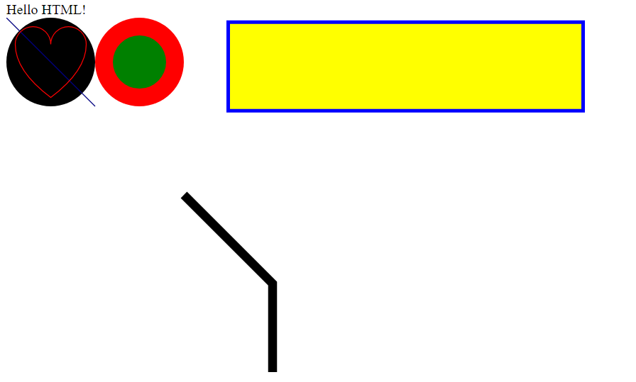
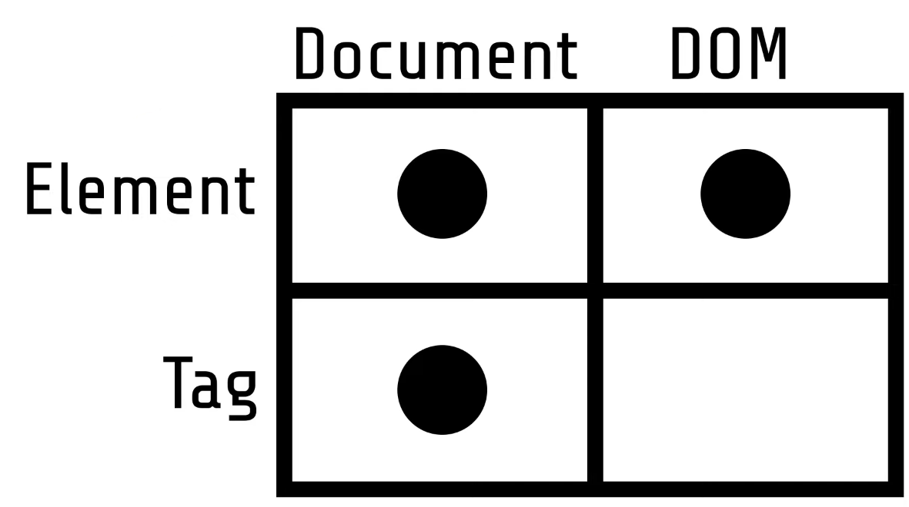

# Data Visualization with D3

## 1. SVG Fundamentals

**HTML** - language of the web



SVG - Scalable Vector Graphics
CSS - Cascading Style Sheets
JS - JavaScript
HTTP - Hypertext transfer Protocol

HTML standards are maintained by W3C [World wide Web Consortium]

#### svg tag

```html
<svg width="100" height="100">
  <circle cx="50" cy="50" r="40" stroke="green" stroke-width="4" fill="yellow" />
</svg>
```

**svg path tag:**

M = moveto <br>
L = lineto <br>
H = horizontal lineto <br>
V = vertical lineto <br>
C = curveto <br>
S = smooth curveto <br>
Q = quadratic Bézier curve <br>
T = smooth quadratic Bézier curveto <br>
A = elliptical Arc <br>
Z = closepath <br>

## 2. Pseudo Visualizations



Document: In web development, a document refers to an HTML document, which is the main file that contains the content and structure of a web page. It's typically represented as an instance of the Document Object Model (DOM) and can be accessed and manipulated using JavaScript. The document provides a programming interface to interact with the elements and content of the web page.

DOM (Document Object Model): The DOM is a programming interface for HTML (and XML) documents. It represents the structured representation of the HTML document as a tree-like structure, where each element, attribute, and text node in the document is represented as an object with properties and methods. The DOM allows developers to access, manipulate, and modify the elements and content of a web page dynamically using scripting languages like JavaScript.

Element: An element is a fundamental building block of an HTML document represented in the DOM. It corresponds to an individual component of a web page, such as a paragraph (<p>), a heading (<h1>), an image (), a button (<button>), etc. Each element is represented as an object in the DOM tree and can have attributes, styles, child elements, and event handlers associated with it.

Tag: In HTML, a tag is a keyword enclosed in angle brackets (< and >) that defines an element. It specifies the type and structure of an element within an HTML document. Tags are used to create the structure and content of a web page by indicating how elements should be displayed and organized. For example, <p> is a tag that defines a paragraph element, <h1> defines a heading element, and so on.